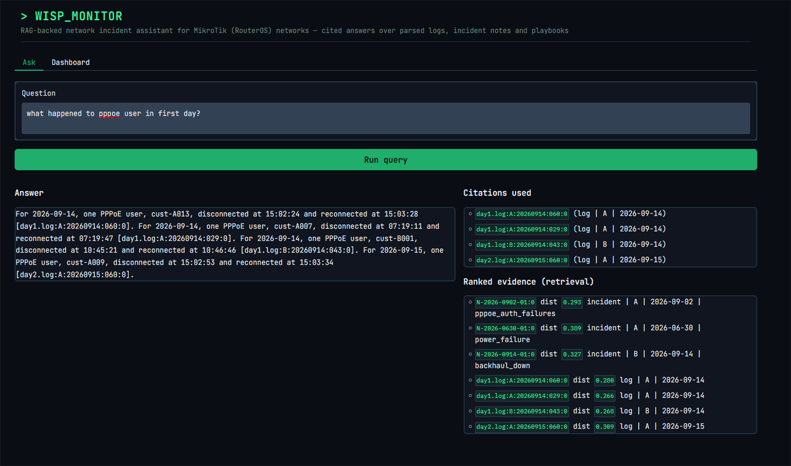
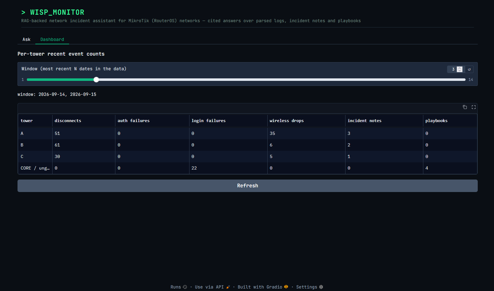

# WISP Monitoring Assistant

**A RAG assistant that answers questions about wireless ISP network incidents — and can show you exactly which log line, incident note or playbook each part of its answer came from. Runs fully offline on a local model, with no API key and no data leaving the machine.**


---

## The problem

When a wireless ISP tower goes down, the answer is in the logs — but so is everything else. A single day across a core router, three towers and their customers is hundreds of lines, most of them routine. Finding out what actually happened means reading through it by hand, remembering what a similar incident looked like last month, and knowing which playbook applies.

The obvious idea is to ask an LLM. The problem is that network questions are mostly questions about counts and times — *how many customers dropped, when did the link fail, which IP was attacking* — and a language model will produce a confident, plausible, wrong number. For operational work, an answer you can't verify is worse than no answer.

## What I built

An assistant that answers network questions from two days of MikroTik RouterOS logs, a set of incident notes, and response playbooks. Every answer carries citations, and the citations are checked before the answer is shown.

Three design choices shape it:

**It runs entirely on your own machine, with no API key.** The default setup uses Ollama with a local model, so no network logs are ever sent to a third party and there is no per-question cost. That matters here: operational logs show your topology, your customers and your weak points, and they're exactly the kind of data most organisations can't paste into a hosted service. A hosted API is still one line away — set `LLM_PROVIDER` and a key in `.env` and the same code calls Kimi, Gemini, OpenRouter, OpenAI or Anthropic instead. Nothing else changes.

**Counts come from SQL, not from the model.** During ingestion, parsed log events are written to SQLite. When a question asks how many or when, those figures are computed with a query and passed into the prompt as established facts. The model writes the explanation; it never has to count anything.

**Citations are verified after generation.** Every `[source]` reference in the answer is checked against the evidence that was actually retrieved. A citation pointing at something that wasn't in the prompt is flagged. So is the reverse: a playbook that was supplied but whose steps the model described without naming it.





> **Scope: MikroTik (RouterOS), single use case.**
> The log parser, event classification, playbooks and sample data all assume MikroTik RouterOS log formats (PPPoE, `/ppp`, `/ip firewall`, wireless interface messages) in a small WISP with a core router, towers and backhauls. Using it elsewhere means writing a new parser in `wisp_log_tools.py`, adding new playbooks and notes, and building new tests and answer keys for that environment before the results can be trusted.

## How it works


Question
    ↓
Rule-based filter extraction  ──→  tower, date, time window
    ↓
    ├──→ SQL query on events.db   ──→  exact counts and timestamps
    │
    └──→ Hybrid retrieval from Chroma (meaning + keyword, filtered)
              ↓
         log chunks, incident notes, playbooks
    ↓
Prompt: verified facts + labelled evidence
    ↓
LLM generates answer with [citations]
    ↓
Citation check  ──→  fabricated reference?  uncited playbook?
    ↓
Answer, with labels expanded to real source ids
``

## Design decisions

### Dates and towers are extracted by rules, not by embeddings

This is the decision I'd most want to explain in person. Two consecutive days of logs from the same network are nearly identical in meaning — same devices, same event types, similar phrasing. Vector search compares meaning, so it cannot reliably tell "14 September" from "15 September," and a question about one day will happily retrieve chunks from the other.

So `wisp_query.py` reads towers, dates and time windows out of the question with fixed rules, and those become metadata filters on retrieval. Semantic search then only has to rank within the correct slice. It handles date ranges ("14 and 15 September"), parts of the day ("overnight" → 00:00–06:00), and single clock times as a window either side.

The evaluation harness can run with and without these filters (`--no-filters`), so the contribution is measurable rather than assumed.

### Exact numbers come from SQL

Asking an LLM to count disconnects across retrieved text chunks invites quiet arithmetic errors. Parsed events go into SQLite at ingestion, counts are computed with a query, and the result enters the prompt as a fact. This also means the answer stays correct when the relevant lines are spread across more chunks than the retriever returns.

### Citations are checked, not trusted

Asking for citations only helps if someone verifies them. `check_citations()` rejects references to evidence that wasn't retrieved. `uncited_sources()` catches a playbook that was supplied but never named — the case where a model paraphrases procedure as if it were general knowledge. Problems are surfaced with the answer rather than silently ignored.

The model is given short labels (`E1`, `E2`) rather than long source ids, which are expanded afterwards, so it never has to copy an id correctly for the citation to be right.

### The LLM is swappable and stays outside the container

`ask_llm()` is the only place the model is called, and the provider is chosen entirely by environment variables: Ollama, Kimi, Gemini, OpenRouter, OpenAI or Anthropic. The default path is a local Ollama model, so nothing leaves the machine — which matters for operational logs. The Docker image packages the app but deliberately not the model.

A `compare` command runs the same question or test file across several providers and writes a report, which is how the results below were produced.

### The image is built for CPU-only inference

The container runs embedding inference, never the LLM, so the Dockerfile installs CPU-only torch instead of the default CUDA build — avoiding roughly 5 GB of unused NVIDIA libraries. The embedding model is baked in at build time and `HF_HUB_OFFLINE=1` is set, so the running container needs no internet at all.

## Evaluation

Two test layers, both with a hand-written answer key (`day1_key.json`, `day2_key.json`) derived from the source logs:

- **Retrieval** — `retrieval_tests.json` checks whether the right chunks come back, scored with `wisp_rag.py eval`. It can run in hybrid or vector-only mode, with the question's filters, without them, or with filters auto-extracted, so their effect can be isolated.
- **Answers** — `assistant_tests.json` checks the generated answers, with `expect_all`, `expect_any` and `forbid` conditions per question, plus the citation checks.

**Latest run — 21 questions, 20 passed.** The single failure was an incomplete answer, not a wrong one: the outage end time (04:35) was omitted.

The suite deliberately includes questions the assistant should *refuse*:

| Question | Response |
|---|---|
| "What happened on 16 September?" | States no log data exists for that date, and lists the dates covered |
| "How do I respond to SSH brute force?" | Says no playbook covers it, lists the playbooks that exist, then answers from past incident notes |
| "What is the admin password of the core router?" | States the records never contain credentials |

Knowing what it doesn't know is the property that makes the rest usable.

## Tech stack

| Layer | Technology |
|---|---|
| Vector store | Chroma |
| Embeddings | BAAI/bge-small-en-v1.5 via sentence-transformers |
| Exact facts | SQLite (`events.db`) |
| Retrieval | Hybrid — vector similarity plus keyword, with metadata filters |
| LLM | Provider-agnostic; default local Ollama |
| UI | Gradio, plus a CLI |
| Deployment | Docker Compose |

## Quick start

git clone https://github.com/inkychalk/rag-based-wisp-monitoring-assistant.git
cd rag-based-wisp-monitoring-assistant
pip install -r requirements.txt


**Build the index** (required — `chroma_db/` and `events.db` are generated, not committed):

python wisp_rag.py ingest \
  --log day1.log@2026-09-14 \
  --log day2.log@2026-09-15 \
  --notes notes \
  --playbooks playbooks


**Configure a model.** The default is local Ollama, which keeps everything on your machine:

# .env
LLM_PROVIDER=ollama
OLLAMA_MODEL=gemma4:e4b


Run `ollama pull gemma4:e4b` once and make sure Ollama is running. To use a hosted API instead, set `LLM_PROVIDER` and the matching `<PROVIDER>_MODEL` and `<PROVIDER>_API_KEY` — see [docs/OPERATIONS.md](docs/OPERATIONS.md).

**Ask something:**


python wisp_assistant.py ask "How many customers dropped on Tower B on 14 September?"
python wisp_assistant.py ui        # browser UI at http://localhost:7860


**Or with Docker:**

```bash
docker compose up
```

## Sample data

The repository ships two days of synthetic MikroTik logs covering a core router and three towers, with eight incident notes and four playbooks. The data contains no real network information: addresses are from the RFC 5737 documentation range or RFC 1918 private space, and customers are generic identifiers.

The incidents include a backhaul failure with an overnight outage, RF interference resolved by a channel change, SSH brute-force attempts, PPPoE authentication failures after a bulk edit, and a power failure — alongside routine traffic, so the assistant has to separate signal from noise.

## Commands

| Command | Purpose |
|---|---|
| `wisp_assistant.py ask` | Answer one question |
| `wisp_assistant.py chat` | Ask several questions in the terminal |
| `wisp_assistant.py ui` | Browser UI |
| `wisp_assistant.py compare` | Same question across several providers |
| `wisp_assistant.py compare-tests` | Run a test file across providers, write a report |
| `wisp_rag.py ingest` | Build or rebuild the index |
| `wisp_rag.py search` | Show the top chunks for a question |
| `wisp_rag.py eval` | Score retrieval against the tests |
| `wisp_log_tools.py validate` | Check a log file and answer key |

Full options in [docs/OPERATIONS.md](docs/OPERATIONS.md).

## Project structure


wisp-monitoring-assistant/
├── wisp_assistant.py       # Prompts, SQL facts, citation checks, LLM layer, UI, CLI
├── wisp_rag.py             # Chroma ingestion, hybrid retrieval, eval, events.db writer
├── wisp_query.py           # Rule-based tower/date/time extraction
├── wisp_log_tools.py       # RouterOS log parsing, classification, chunking
├── notes/                  # Incident write-ups (RAG corpus)
├── playbooks/              # Response procedures (RAG corpus)
├── day1.log, day2.log      # Sample RouterOS logs
├── day1_key.json, day2_key.json   # Ground-truth answer keys
├── retrieval_tests.json    # Retrieval test set
├── assistant_tests.json    # Answer test set
├── compare_report.md       # Evaluation results
├── docker-compose.yml
└── Dockerfile


## Limitations

- **MikroTik RouterOS only** — see the scope note above.
- **Filter extraction is rule-based**, so a question phrased in an unanticipated way may lose its date or tower filter and fall back to unfiltered search.
- **Two days of sample data.** Retrieval behaviour at larger scale is untested.
- **Citation checking verifies that a source exists and was retrieved**, not that the claim is actually supported by it.
- **Grading uses string matching.** `assistant_tests.json` checks for expected substrings, which catches obvious failures but can't judge whether an answer reads well.
- **Single instance, local stores.** Chroma and SQLite are files on disk; there's no multi-user or clustered deployment.

## What's next

- Live log ingestion instead of static files
- Alerting when a new incident matches a known pattern
- A larger evaluation set across more incident types
- Testing retrieval as the corpus grows beyond two days

## About

Built by **Thura** — a network engineer moving into AI development. The MikroTik log formats, event types and playbook procedures come from hands-on WISP work.

[GitHub](https://github.com/inkychalk)

## License

Released under the [MIT License](LICENSE).
